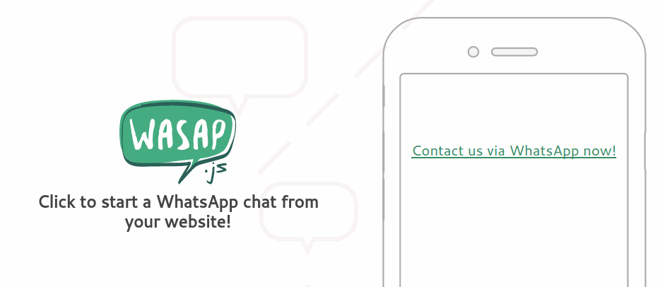

wasap.js
====



[**wasap.js**](https://www.conversabit.com/wasap.js/) • [Demos](https://www.conversabit.com/wasap.js/demos/)

### Installation

First, add the `data-whatsapp` attribute to the nodes you want to be clickable:

```
<span data-whatsapp="5210000000000">Reach me via WhatsApp!</span>
```

Then include the JS file and initialize it.

```
wasap.init();
```

### Element options

`data-whatsapp` is required, it's recommended to be a `<span>` tag (or any inline element for that matter), and it must not be an `<a>` element.

- `data-whatsapp` (required) • Be sure to use the international phone format for better results and use just numbers—no hyphens, spaces or signs.
- `data-whatsapp-message` (optional) • Preset a message.

### API

**➡ `enableIf`** (regex|function|boolean, defaults to `/android|iphone|ipad/i`)

Platforms supported currently, if regex, matches against `window.navigator.userAgent`. When used as a function it can be more modular, and the boolean disables or enables for every platform.

**➡ `protocolIf`** (regex|function|boolean, defaults to `/android|iphone|ipad/i`)

If enabled, what conditions should be met to redirect the user to the `whatsapp` protocol instead of the `http` URL, which isn't working on mobile at the moment.

**➡ `openCallback`** (function, defaults to `window.open`)

If `elementCallback` enabled, you could prevent a click from triggering to do a custom action. After this custom behaviour, this function defines how the user will be redirected.

**➡ `elementCallback`** (function)

Callback made to each of the elements found, so you can customize its behaviour (click callbacks, other events, modify the node's content, etc.)

**➡ `newNodeSelector`** (string, defaults to a)

The element that will be appended to the target element, which tag name should it have? If a, it will create the href attribute. It supports IDs and classes.

### Contribute

1. Install NodeJS ([NVM](https://github.com/creationix/nvm/blob/master/nvm.sh))
2. Run `nvm use 4 && npm install`
3. Then `npm run dev`

### Roadmap

- [ ] Tests
- [ ] Figure out what to do with WhatsApp Web
